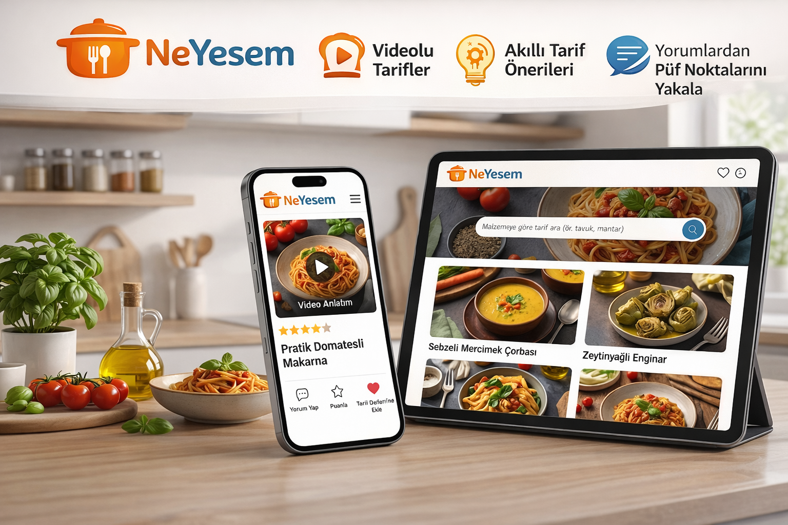

# NeYesem?

## Proje Hakkında

**Proje Tanımı:** 
NeYesem, kullanıcıların yemek tariflerine kolayca ulaşabildiği, kendi tariflerini paylaşabildiği ve diğer kullanıcılarla etkileşim kurabildiği, web ve mobil uyumlu bir yemek tarifleri platformudur.

Platform, kullanıcı deneyimini artırmak amacıyla videolu anlatım desteği, puanlama sistemi, yorum yapma özelliği, kişisel planlama imkânı ve yapay zekâ destekli akıllı öneri sistemleri sunmaktadır.

 Temel Özellikler:

- Kullanıcıların yeni tarif ekleyebilmesi

- Tariflere video ekleyebilmesi

- Tarifleri puanlayabilmesi

- Yorum yapabilmesi

- Tarif Defteri özelliği ile yapmak istedikleri tarifleri kişisel listelerine ekleyebilmesi

- Malzemeye göre tarif arama özelliği sayesinde elde bulunan malzemelere uygun tarifleri filtreleyebilmesi

- Yapay zekâ destekli tarif analizi ile tarifleri daha sağlıklı hale getirme önerileri sunulması

- Yapay zekâ destekli yorum özetleme sistemi ile kullanıcı yorumlarından genel değerlendirme ve püf noktalarının otomatik çıkarılması

NeYesem, kullanıcıların “Bugün ne yesem?” sorusuna hızlı, pratik ve kişiselleştirilmiş çözümler sunmayı hedefler. Yapay zekâ entegrasyonu sayesinde kullanıcılar tarifleri beslenme hedeflerine göre uyarlayabilir ve uzun yorumları okumadan hızlıca bilgi edinebilirler.

Platform, hem masaüstü hem de mobil cihazlarda sorunsuz çalışacak şekilde responsive (duyarlı) tasarım prensiplerine uygun olarak geliştirilecektir.

**Proje Kategorisi:** 
> Yemek / Tarif Platformu (Food & Recipe Platform)

**Referans Uygulama:** 
> https://www.nefisyemektarifleri.com/

---

## Proje Linkleri

- **REST API Adresi:** https://ne-yesem-amber.vercel.app/
- **Web Frontend Adresi:** https://ne-yesem-frontend.vercel.app/
---

## Proje Ekibi

**Grup Adı:** 

Double S Studio

**Ekip Üyeleri:** 
- Selin Pire

- Sude Koçak

## Dokümantasyon

Proje dokümantasyonuna aşağıdaki linklerden erişebilirsiniz:

1. [Gereksinim Analizi](Gereksinim-Analizi.md)
2. [REST API Tasarımı](API-Tasarimi.md)
3. [REST API](Rest-API.md)
4. [Web Front-End](WebFrontEnd.md)
5. [Mobil Front-End](MobilFrontEnd.md)
6. [Mobil Backend](MobilBackEnd.md)
7. [Video Sunum](Sunum.md)

---

